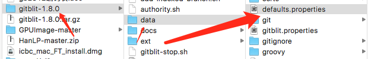

## gitosis步骤:(放弃)
```
注:mac自带git和phyon
参考: http://www.cnblogs.com/weijingyun/p/4716858.html
	1.	git --version
	2.	python --version
	3.	git clone https://www.github.com/tv42/gitosis.git
Cloning into 'gitosis'...
remote: Counting objects: 661, done.
remote: Total 661 (delta 0), reused 0 (delta 0), pack-reused 661
Receiving objects: 100% (661/661), 118.13 KiB | 12.00 KiB/s, done.
Resolving deltas: 100% (430/430), done.
 
	1.	cd /Users/jia/gitosis 
 
	1.	sudo python setup.py install
 
	1.	cd~
 
	1.	ssh-keygen -t rsa
Generating public/private rsa key pair.
Enter file in which to save the key (/Users/jia/.ssh/id_rsa): 
Enter passphrase (empty for no passphrase): 
Enter same passphrase again: 
Your identification has been saved in /Users/jia/.ssh/id_rsa.
Your public key has been saved in /Users/jia/.ssh/id_rsa.pub.
The key fingerprint is:
SHA256:ICnhZA09KjO+GASLRbf4GLnWtvd/eQ8a4e8hBE/+M7s jia@localhost
The key's randomart image is:
+---[RSA 2048]----+
| .*+.            |
|.+.=+o           |
|oo*.+..   . .    |
|*..B . .   =     |
|o++ +   S   =    |
|.o . .     o o   |
|... . .     +.*  |
|..   . .    o=.* |
|        .....oEo.|
+----[SHA256]-----+
 
	1.	cd /Users/jia/.ssh 
 
	1.	ls
github_rsa github_rsa.pub id_rsa id_rsa.pub known_hosts
 
	1.	放弃;
```


## gitblit步骤:(成功)

> 参考: http://blog.csdn.net/pony_maggie/article/details/50880142


1.	下载

	```
	a.	首选 http://gitblit.com/
	b.	备选 		i.	http://mac.softpedia.com/dyn-postdownload.php/b5759a62cb81ab1b5bdbe64048d77f0c/58f7274a/21655/0/1?tsf=0
		ii.	http://akamai.bintray.com/15/155cf8af49c76fbe6ea73383462c468fa8d69bad?__gda__=exp=1492592617~hmac=25a33212c3825c0242eebe0f8fbe3a746b30d85ec4e3db8bbc72ca69c47cf621&response-content-disposition=attachment%3Bfilename%3D%22gitblit-1.6.2.tar.gz%22&response-content-type=application%2Foctet-stream&requestInfo=U2FsdGVkX18qTwH5n-lYZI_DgnE1HLwWdfOYG369bLD6nwt-l7xqRTRjtWsHU5kw5FrMYVS-gikf0J1S5byJ7Lavcooo-T9ZwGjfM05YIQT6vc4oazsJ1tH9_B9s5itTtttueyk7haNG9NhNSUzpYpv_99n2QL9E2r0H0O1ChtoNrvuyiJxLWol_Ipy4bGddiZJN4C35LkyH_sIglH9Hzet-58JdmRxpcJE7cjimJ1U
	```

2.	创建git根文件夹/Users/jia/Desktop/gitblit/repositoryFolder
3.	打开defaults.properties

	

4.	配置路径:

	```
	#git.repositoriesFolder = ${baseFolder}/git
	git.repositoriesFolder = /Users/jia/Desktop/gitblit/repositoryFolder
	```
5.	配置端口

	```
	#server.httpPort = 0
	server.httpPort = 7070
	```
 
6.	运行:

	```
	localhost:gitosis jia$ cd /Users/jia/Desktop/gitblit/gitblit-1.8.0 
	localhost:gitblit-1.8.0 jia$ ./gitblit.sh
	```

7.	访问Web后台:
	<http://localhost:7070> user:admin pwd:admin
 
8.	用mac的github客户端打开项目

	


## github和gitblit指向到同一项目文件夹;

	1.	在gitblit创建projectParent;
	2.	在github创建projectSon;
	3.	将projectSon放到projectParent文件夹下;然后移projectSon下的.git文件夹到别处去;
	4.	将projectSon提交同步到projectParent项目;
	5.	将projectSon下的.git移回来;
	6.	完成;

 

## 服务器迁移到本地仓库:

1. 在本地下载祼库:git clone --bare yourGitReposURL
2. 在本地释放项目目录:git clone your祼库地址

## gitbucket迁移到服务器仓库:

1. 在服务器下载祼库:git clone --bare yourGitReposURL
2. 在本地释放项目目录:git clone root@jiaxiaogang.top:/root/服务器祼库地址/祼库项目名称.git

## 服务器gitbucket

1. 下载gitbucket.war: https://github.com/gitbucket/gitbucket
2. 使用后台挂起java命令跑起来;

## 本地仓库迁移到码云仓库:

1. 在码云创建repos/yourRepos,并取到 https://gitee.com/jiaxiaogang/yourRepos.git
2. 在本地cd到本地库目录;
3. git remote rm origin
4. git remote add origin https://gitee.com/jiaxiaogang/youRepos.git
5. 提交本地库到码云;

## 服务器库迁移到码云库:

1. 1. 在码云创建repos/yourRepos,并选择来自库地址;
2. 输入服务端库地址如:http://www.jiaxiaogang.top:8080/git/root/yourRepos.git

## 更改github库的email,修复绿点不亮的问题

1. cd /Volumes/APPLE\ HDD/work/temp/NOTE
2. cd.. 到上级文件夹,并创建文件gitUserChange.sh
3. sh ../gitUserChange.sh `成功时提示:Ref 'refs/heads/master' was rewritten`
4. git push -u origin master -f `成功时提示:Branch 'master' set up to track remote branch 'master' from 'origin'.`

```sh
# gitUserChange.sh文件内容 / 将所有名字邮件都改掉
git filter-branch -f --env-filter "
GIT_AUTHOR_NAME='jiaxiaogang';
GIT_AUTHOR_EMAIL='jxg2764894@live.com';
GIT_COMMITTER_NAME='jiaxiaogang';
GIT_COMMITTER_EMAIL='jxg2764894@live.com'
" HEAD
```

```sh
#将所有jia2764894@126.com改成jxg2764894@live.com
git filter-branch -f --env-filter '
if [ "$GIT_COMMITTER_EMAIL" = "jia2764894@126.com" ]
then
export GIT_COMMITTER_NAME="jiaxiaogang"
export GIT_COMMITTER_EMAIL="jxg2764894@live.com"
export GIT_AUTHOR_NAME="jiaxiaogang"
export GIT_AUTHOR_EMAIL="jxg2764894@live.com"
fi
' HEAD

git filter-branch -f --env-filter '
if [ "$GIT_COMMITTER_EMAIL" = "283636001@126.com" ]
then
export GIT_COMMITTER_NAME="jiaxiaogang"
export GIT_COMMITTER_EMAIL="jxg2764894@live.com"
export GIT_AUTHOR_NAME="jiaxiaogang"
export GIT_AUTHOR_EMAIL="jxg2764894@live.com"
fi
' HEAD
```
