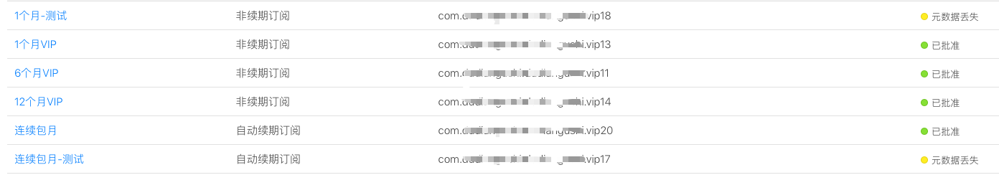

| 流程 >> |
| --- |

|  |  |  |
| --- | --- | --- |
| 1 | 在https://itunesconnect.apple.com/我的APP-功能-APP内购买项目 | 如图1 |
| 2 | 不可在点击购买时要求登录等收集数据 |  | 
| 3 | 连续包月时,在app发布描述中要声明; | 【自动续费会员说明】 —订阅周期：1个月（连续包月产品）； —订阅价格：连续包月产品为每月10元； —付款：用户确认购买并付款后计入iTunes账户； —取消订阅：如需取消续订，请在当前订阅周期到期前24小时以前，手动在苹果iTunes/Apple ID设置中关闭自动续订功能。 —续订：苹果iTunes账户会在到期前24小时内扣费，扣费成功后订阅周期顺延一个订阅周期。 |
| 4 | https://github.com/saturngod/IAPHelper |  |

| 图1 |
| --- |
|  |
