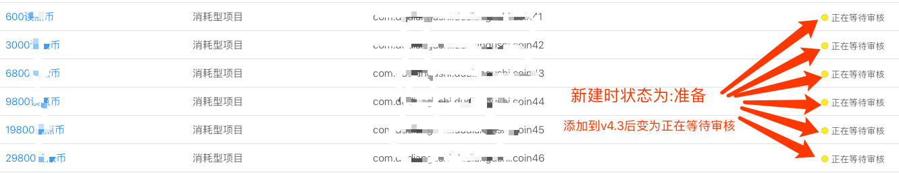

<!-- TOC depthFrom:1 depthTo:6 withLinks:1 updateOnSave:1 orderedList:0 -->

- [1. xcode高版本支持ios7设备调试:](#1-xcode高版本支持ios7设备调试)
- [2. animate动画退后台后,再回前台动画停止;](#2-animate动画退后台后再回前台动画停止)
			- [原因:](#原因)
			- [解决方式:](#解决方式)
- [3. UIView animate:duration{}添加动画失败](#3-uiview-animateduration添加动画失败)
- [4. UIMenuController使用之坑](#4-uimenucontroller使用之坑)
- [4. UIPageControl间距设置](#4-uipagecontrol间距设置)
		- [1. `运行时法`](#1-运行时法)
		- [2. `继承法`](#2-继承法)
- [import "CLPageControl.h"](#import-clpagecontrolh)
- [define dotW 7](#define-dotw-7)
- [define magrin 5](#define-magrin-5)
- [5. ios11-tableview.contentSize计算错误bug](#5-ios11-tableviewcontentsize计算错误bug)
- [6. 动画循环问题](#6-动画循环问题)
- [7. ios11的naviBar的返回按钮间距问题;](#7-ios11的navibar的返回按钮间距问题)
- [import <Foundation/Foundation.h>](#import-foundationfoundationh)
- [import <UIKit/UIKit.h>](#import-uikituikith)
- [import "UIBarButtonItem+Extension.h"](#import-uibarbuttonitemextensionh)
- [8. 动画自动跳回灵异事件;](#8-动画自动跳回灵异事件)
- [9. IOS审核消耗型产品](#9-ios审核消耗型产品)
- [10. UIPageViewController的子页面缓存池](#10-uipageviewcontroller的子页面缓存池)
- [11. UIPageViewController嵌套ScrollView的焦点冲突](#11-uipageviewcontroller嵌套scrollview的焦点冲突)

<!-- /TOC -->


***


# 1. xcode高版本支持ios7设备调试:

1.  将7.1DeviceSupport文件放到/Applications/Xcode.app/Contents/Developer/Platforms/iPhoneOS.platform/DeviceSupport
2. 将应用程序-xcode 显示包内容-Contents-Developer-Platforms-iPhoneOS.platform-Developer-SDKs-iPhoneOS.sdk-SDKSettings.plist 又没写 8.0 以下的

	```
	Root/DefaultProperties/DEPLOYMENT_TARGET_SUGGESTE.../添加itemx=7.1
	```

3. 把项目根目录下Tanker.xcodeproj
	1. 显示包内容
	2. 打开project.pbxproj
	3. 搜索TARGET_把值改成7.1

4. Finish


# 2. animate动画退后台后,再回前台动画停止;

#### 原因:
* ios默认系统会停掉;


#### 解决方式:

1. 把[UIView animate...]的方式改成CABaseAnimation实例的方式;代码如下:

	```objective-c

	if (![self.aLab.layer animationForKey:@"translationAnimation"]) {
	    CABasicAnimation* aAni = [CABasicAnimation animationWithKeyPath:@"transform.translation.x"];
	    aAni.toValue = [NSNumber numberWithFloat:-self.aLab.width];
	    aAni.duration = self.aLab.width / 20;
	    aAni.cumulative = YES;
	    aAni.removedOnCompletion = false;
	    aAni.delegate = self;
	    [self.aLab.layer addAnimation:aAni forKey:@"translationAnimation"];
	}

	```

2. 实现CAAnimationDelegate,代码如下

	```objective-c

	/**
	 *  MARK:--------------------CAAnimationDelegate--------------------
	 */
	- (void)animationDidStart:(CAAnimation *)anim{}

	- (void)animationDidStop:(CAAnimation *)anim finished:(BOOL)flag{
	    [self animationStop];
	    [self animationStart];//此处代码错误;因为delegate会导致死循环;见问题6;
	}

	```

# 3. UIView animate:duration{}添加动画失败

| 问题描述 >> |
| --- |
| 在detailGuideBeVipTopBar时,animationStart总是失败,发现refreshDisplay时, |
| 可能还未didAppear;但应该是已经addSubView了;所以这个添加动画失败应该是未didAppear而不是未addSubView;(未验证) |
| 同理,以前DTCoreText的resetLayout方法一直需要延迟也有可能是这个问题;(未验证) |


# 4. UIMenuController使用之坑

1. 必写:

```objective-c
[self becomeFirstResponder];//必写

UIMenuController *menuController = [UIMenuController sharedMenuController];
UIMenuItem *itemDelete = [[UIMenuItem alloc] initWithTitle:LOCALIZE_KEY(@"删除") action:@selector(deleteBtnOnClick:)];
UIMenuItem *itemReport = [[UIMenuItem alloc] initWithTitle:LOCALIZE_KEY(@"举报") action:@selector(reportBtnOnClick:)];
[menuController setMenuItems:@[itemDelete,itemReport]];
[menuController setTargetRect:self.descLab.bounds inView:self.descLab];
[menuController setMenuVisible:YES animated:YES];
```

2. 在本View.class类中必须实现两个方法:

```objective-c
-(BOOL)canBecomeFirstResponder{
    return YES;
}

-(BOOL)canPerformAction:(SEL)action withSender:(id)sender {
    if (action == @selector(deleteBtnOnClick:) || action == @selector(reportBtnOnClick:)){
        return YES;
    }
    return NO;
}
```
3. 必须实现每一个SEL

```objective-c
-(void) deleteBtnOnClick:(id)sender{
    if (self.delegate && [self.delegate respondsToSelector:@selector(veReplyPageHeader_DeleteBtnOnClick)]) {
        [self.delegate veReplyPageHeader_DeleteBtnOnClick];
    }
}

-(void) reportBtnOnClick:(id)sender{
    if (self.delegate && [self.delegate respondsToSelector:@selector(veReplyPageHeader_ReportBtnOnClick)]) {
        [self.delegate veReplyPageHeader_ReportBtnOnClick];
    }
}
```


# 4. UIPageControl间距设置


### 1. `运行时法`

```objective-c
//MARK:===============================================================
//MARK:                     < UIPageControl_Distance >
//MARK:===============================================================
@interface UIPageControl (Distance)
@end
@implementation UIPageControl (Distance)
+ (void)load{
    Method origin = class_getInstanceMethod([self class], @selector(_indicatorSpacing));
    Method custom;
    if ([[[UIDevice currentDevice] systemVersion] floatValue] >= 10) {
        custom = class_getInstanceMethod([self class], @selector(custom_indicatorSpacing_IOS10_X));
    }else{
        custom = class_getInstanceMethod([self class], @selector(custom_indicatorSpacing_IOS7_9));
    }
    method_exchangeImplementations(origin, custom);
}
- (float)custom_indicatorSpacing_IOS7_9{
    return 8.0;
}
- (double)custom_indicatorSpacing_IOS10_X{
    return 8.0;
}

@end
```

### 2. `继承法`

```objective-c
#import "CLPageControl.h"
#define dotW 7
#define magrin 5

@implementation CLPageControl

- (void)layoutSubviews
{
    [super layoutSubviews];

    //计算圆点间距
    CGFloat marginX = dotW + magrin;

    //计算整个pageControll的宽度
    CGFloat newW = (self.subviews.count - 1 ) * marginX;

    //设置新frame
    self.frame = CGRectMake(self.frame.origin.x, self.frame.origin.y, newW, self.frame.size.height);

    //设置居中
    CGPoint center = self.center;
    center.x = self.superview.center.x;
    self.center = center;

    //遍历subview,设置圆点frame
    for (int i=0; i<[self.subviews count]; i++) {
        UIImageView* dot = [self.subviews objectAtIndex:i];

        if (i == self.currentPage) {
            [dot setFrame:CGRectMake(i * marginX, dot.frame.origin.y, dotW, dotW)];
        }else {
            [dot setFrame:CGRectMake(i * marginX, dot.frame.origin.y, dotW, dotW)];
        }
    }
}
```


# 5. ios11-tableview.contentSize计算错误bug

```objective-c
//(在ios11连续reloadData会导致此bug)
结果是ios11一个开关自动打开有关;解决如下:

[UITableView appearance].estimatedRowHeight = 0;
[UITableView appearance].estimatedSectionHeaderHeight = 0;
[UITableView appearance].estimatedSectionFooterHeight = 0;
```


# 6. 动画循环问题

```objective-c
1. 在ios的[UIView animate...] 和 CAAnimation动画中,不能使用Delegate或者complete来循环动画;
2. 因为这些动画在非前台页面时,会finish=false;此时,循环会形成死循环,爆cpu;
3. 所以应该使用计时器timer,或者使用//topAni.repeatCount = HUGE_VALF;的方式来实现循环;
```


# 7. ios11的naviBar的返回按钮间距问题;

```objective-c
//
//  UIBarButtonItem+Extension.h
//  Tanker
//
//  Created by 贾  on 2017/11/3.
//  Copyright © 2017年 CaoMing. All rights reserved.
//

#import <Foundation/Foundation.h>

#import <UIKit/UIKit.h>

@interface BackView:UIView

@property(nonatomic,strong)UIButton *btn;

@end


@interface UIBarButtonItem (addition)
+ (UIBarButtonItem *)itemWithTitle:(NSString *)title target:(id)target action:(SEL)action;

+ (UIBarButtonItem *)itemWithIcon:(NSString *)icon highIcon:(NSString *)highIcon target:(id)target action:(SEL)action;
@end
```

```objective-c
//
//  UIBarButtonItem+Extension.m
//  Tanker
//
//  Created by 贾  on 2017/11/3.
//  Copyright © 2017年 CaoMing. All rights reserved.
//

#import "UIBarButtonItem+Extension.h"


@implementation BackView

- (instancetype)initWithFrame:(CGRect)frame
{
    self = [super initWithFrame:frame];
    if (self) {
        self.backgroundColor = [UIColor clearColor];
    }
    return self;
}
-(void)layoutSubviews{
    [super layoutSubviews];
    UINavigationBar *navBar = nil;
    UIView *aView = self.superview;
    while (aView) {
        if ([aView isKindOfClass:[UINavigationBar class]]) {
            navBar = (UINavigationBar *)aView;
            break;
        }
        aView = aView.superview;
    }
    UINavigationItem * navItem =   (UINavigationItem *)navBar.items.lastObject;
    UIBarButtonItem *leftItem = navItem.leftBarButtonItem;
    UIBarButtonItem *rightItem = navItem.rightBarButtonItem;


    if (rightItem) {//右边按钮
        BackView *backView = rightItem.customView;
        if ([backView isKindOfClass:self.class]) {
            backView.btn.x = backView.width -backView.btn.width;
        }
    }
    if (leftItem) {//左边按钮
        //        BackView *backView = leftItem.customView;

    }
}


@end


@implementation UIBarButtonItem (addition)
+ (UIBarButtonItem *)itemWithIcon:(NSString *)icon highIcon:(NSString *)highIcon target:(id)target action:(SEL)action {
    BackView *customView = [[BackView alloc] initWithFrame:CGRectMake(0, 0, 80, 44)];
    UITapGestureRecognizer *tap = [[UITapGestureRecognizer alloc] initWithTarget:target action:action];
    [customView addGestureRecognizer:tap];
    customView.btn = [UIButton buttonWithType:UIButtonTypeCustom];
    customView.btn.titleLabel.font = [UIFont systemFontOfSize:16.0];
    if (icon) {
        [customView.btn setBackgroundImage:[UIImage imageNamed:icon] forState:UIControlStateNormal];
    }
    if (highIcon) {
        [customView.btn setBackgroundImage:[UIImage imageNamed:highIcon] forState:UIControlStateHighlighted];
    }
    customView.btn.frame = CGRectMake(-6, 0, customView.btn.currentBackgroundImage.size.width, customView.btn.currentBackgroundImage.size.height);
    customView.btn.centerY = customView.centerY;
    [customView.btn addTarget:target action:action forControlEvents:UIControlEventTouchUpInside];
    [customView addSubview:customView.btn];
    return  [[UIBarButtonItem alloc] initWithCustomView:customView];
}

+ (UIBarButtonItem *)itemWithTitle:(NSString *)title target:(id)target action:(SEL)action {
    UIButton *btn = [[UIButton alloc] init];
    [btn setTitle:title forState:UIControlStateNormal];
    btn.titleLabel.font = [UIFont systemFontOfSize:16.0];
    [btn setTitleColor:[UIColor lightGrayColor] forState:UIControlStateDisabled];
    [btn setTitleColor:[UIColor blackColor] forState:UIControlStateNormal];
    [btn setTitleColor:[UIColor blackColor] forState:UIControlStateHighlighted];
    [btn addTarget:target action:action forControlEvents:UIControlEventTouchUpInside];
    btn.titleEdgeInsets = UIEdgeInsetsMake(0, 0, 0, -15);
    btn.frame = CGRectMake(0, 0, title.length * 18, 30);
    return  [[UIBarButtonItem alloc] initWithCustomView:btn];
}

@end

```


# 8. 动画自动跳回灵异事件;

```
[UIView animateWithDuration:duration animations:^{
	self.v.y = 300;
}];
问题:当前self.v下的某个子子Lab在setText:有变化时;以上动画自动从300跳回0;
解决:用layer.transform动画替代.y;
```


# 9. IOS审核消耗型产品


| 两种类型 |  |
| --- | --- |
| 1 | 单独审消耗型产品 |
| 2 | 与APP新版同步发审 |

| 1步骤 >> |
| --- |
| 新建消耗型购买项目后,直接选择进行提交 |

| 2步骤 >> |
| --- |
|  |
| 新建消耗型购买项目后,由app新版本发审中,选择`新增内购产品`来添加,并同步审核; |


***

# 10. UIPageViewController的子页面缓存池

| 简介 >> |
| --- |
| 问题:因官方缓存方式,很容易造成自已缓存上与其冲突导致的混乱; |
| 原因:官方是预加载的,但真正滑动显示的时候,却不会再次检测处理;所以如果缓存乱了,导致滑出来的内容乱掉; |
| 解决:只返回自定义缓存池中的index相等或者绝对值差大于1的;即可;代码如下: |

```c
-(ItemPage*) createItemPage:(NSInteger)index{
    DetailPageItemModel *itemModel = [self.pageModel itemModelWithIndex:index];
    if (itemModel) {
        ItemPage *itemVC = nil;

        //1. 找已有
        if (self.viewControllers.count) {
            ItemPage *curItemVC = [self.viewControllers firstObject];
            NSInteger curIndex = curItemVC.getPageIndex;
            //2. 找index相等
            for (ItemPage *vc in self.itemVCCache) {
                if (vc.getPageIndex == itemModel.pageIndex) {
                    itemVC = vc;
                    break;
                }
            }

            //3. 找index差1以上
            if (itemVC == nil) {
                for (ItemPage *vc in self.itemVCCache) {
                    if (labs(vc.getPageIndex - curIndex) > 1) {
                        itemVC = vc;
                        break;
                    }
                }
            }
        }

        //4. newItemVC
        if (itemVC == nil) {
            itemVC = [[ItemPage alloc] init];
            itemVC.delegate = self;
            if (self.itemVCCache.count < 10) {//其实长度最长4,不会有10,作预防
                [self.itemVCCache addObject:itemVC];
            }
        }

        [itemVC setData:self.localModel withItemModel:itemModel withTotalPageIndex:self.pageModel.totalPageIndex];
        return itemVC;
    }
    return nil;
}
```

> 后因,数据变化时,UIPageViewController官方缓存会乱掉的问题,所以将index改变为自定义,只在itemVC.viewWillAppear();时再赋值显示的逻辑;

> 另scrollStyle下时,点击切换页面,不可以使用动画;否则疯狂点击时闪退!!!


# 11. UIPageViewController嵌套ScrollView的焦点冲突

| 问题描述 >> |
| --- |
| itemVC下的scrollView上拉后,因惯性机制,无法立马右滑;(即使上拉时把contentoffset改为zero) |

```java
//解决方式,在BeginDecelerating时,将contentOffset设置为zero,动画NO即可;实测数据见底部:
/**
 *  MARK:--------------------UIScrollViewDelegate--------------------
 */
-(void)scrollViewDidScroll:(UIScrollView *)scrollView{
    if (scrollView.contentOffset.y < 0) {
        [self.bookMarkView setData_OnScroll:offsetY];
    }else{
        [scrollView setContentOffset:CGPointZero];
    }
}

-(void)scrollViewWillBeginDecelerating: (UIScrollView *)scrollView{
    [scrollView setContentOffset:CGPointZero animated:NO];
}

//未解决前;
//2018-04-12 11:41:59.292615+0800 BeginDecelerating______
//2018-04-12 11:41:59.763755+0800 EndDecelerating ______
//
//解决后:
//2018-04-12 11:42:44.292615+0800 BeginDecelerating______
//2018-04-12 11:42:44.292615+0800 EndDecelerating ______
```
