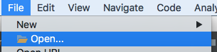
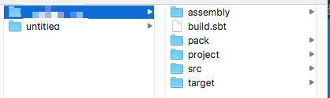
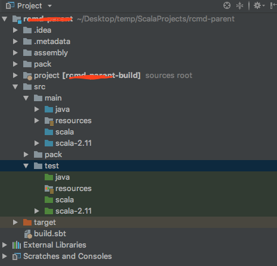

|  |  |  |
| --- | --- | --- |
| 1 | idea | 下载安装idea 并安装scale插件 |
| 2 | 安装scaleSDK | (一般idea会自动安装>但较慢(40分钟左右)) |
| 3 | 安装sbt | `在终端brew install sbt@1` 安装大概5到10分钟(注:如果idea已自动装好,则跳过此步) |
|  | 在idea右侧有 |  |
| 4 | idea中,点open |  |
| 5 | 选中build.sbt所在根目录 |  |
| 6 | 此时项目目录示图 |  |
| 7 | 此时写个Test类.main()试下运行 | 见代码段A |


```
//代码段A
package com.ddgs.spark.rcmd

import com.typesafe.scalalogging.Logger
import org.slf4j.LoggerFactory._


object Test {
  val logger = Logger(getLogger(App.getClass))

  def main(args: Array[String]) {
    println(">>>>>>");
    logger.info("Hello World!")

  }
}

```
