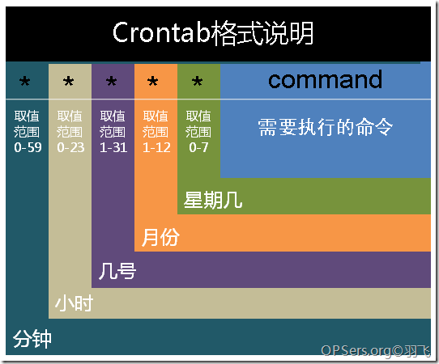

# commend

***

## 1. 账户

|  |  |  |
| --- | --- | --- |
| 1 | ssh登录linux | ssh root@180.76.113.98 |
| 2 | 切换账户 | su username |


<br><br><br><br><br>


## 2. 文件

|  |  |  |
| --- | --- | --- |
| 1 | 查看目录 | ls -a |
| 2 | 删除文件 | rm fileName.md -f |
| 3 | 删除目录 | rm folderName -r -f |
| 4 | 更名 | mv fileOrFolderA fileOrFolderB |
| 5 | 快速查找文件 | locate fileName |
| 6 | 查找 | where is mysql |
| 7 | 创建文件夹 | mkdir xxx |
| 8 | 复制 | cp -r xxx targetFolder |


<br><br><br><br><br>


## 3. 程序

|  | 功能 | 命令 | 目录 |
| --- | --- | --- | --- |
| 1 | 安装java | yum install java |  |
| 2 | 下载 | wget http://xxx.xxx.com/xxx.file |  |
| 3 | mac->linux上传目录 | jia:~ jia$ scp -r /Users/jia/Desktop/Folder root@111.111.111.111:/root/Folder |  |
| 4 | mac->linux上传文件 | scp -r /Users/jia/Desktop/MacFile.md root@111.111.111.111:/root/LinuxFile.md |  |
| 5 | mac->linux下载文件 | scp -r root@180.76.113.98:/root/serviceFileName.md /Users/jia/Desktop/downloadFileName.md |  |
| 6 | 安装tomcat | `wget x.gz` `tar -zxv -f x.x.gz` `tomcat/bin/startup.sh` | 正确 |
| 7 | 安装solo | `将solo.war放到tomcat9/webapps下会自动生成solo文件夹` `cd solo/WEB-INF/classes` `vim latke.properties` `将localhost改成180.76.113.98` | 访问180.76.113.98:8080/solo(注:latke.properties中端口号需与tomcat相同) |
| 8 | 安装git | yum -y install git |  |
| 9 | yum卸载 | yum remove mysql |  |
| 10 | 安装httpd | `yum -y install httpd*` `httd -v` |  |
| 11 | 安装mysql | `yum -y install mysql//客户端` `mysql -V` `yum -y install mysql-server  mysql-devel//服务端` |  |
| 12 | 安装php | `yum -y install php*` `php -v` `/etc/phpMyAdmin/config.inc.php` `vim /etc/httpd/conf.d/phpmyadmin.conf//此处略去一万字` |  |
| 13 | 安装mariadb | `yum install mariadb-server mariadb ` | http://www.runoob.com/mysql/mysql-install.html |
| 14 | 安装tale | `下载http://static.biezhi.me/tale-least.zip` `传到linux解压` `java -jar tale-least.jar` `http://180.76.113.98:9000` |  |


<br><br><br><br><br>


## 4. 压缩

|  |  |  |
| --- | --- | --- |
| 1 | 解压war | jar -xvf fileName.war |
| 2 | 解压zip | unzip fileName.war |
| 3 | 解压gz | tar -zxv -f xxx.tar.gz |


<br><br><br><br><br>


## 5. 运行

|  |  |  |
| --- | --- | --- |
| 1 | 运行war | java -jar fileName.war |
| 2 | 后台运行war | java -jar gitbucket.war & |
| 3 | 挂起运行war | nohup java -jar gitbucket.war |
| 4 | 杀进程 | kill %psId |
| 5 | 前台->后台暂停状态 | Ctrl+z |
| 6 | 后台暂停->运行 | bg %jobnum |


<br><br><br><br><br>


## 6. 系统状态

|  |  |  |
| --- | --- | --- |
| 1 | 查看进程 | ps |
| 2 | 查看后台任务 | jobs |
| 3 | 任务管理器 | top |


<br><br><br><br><br>


## 7. 码农

|  |  |  |
| --- | --- | --- |
| 1 | 访问gitbucket | http://180.76.113.98:8080/gitbucket |
| 2 | tomcat改端口 | `cd tomcat/conf` `vim server.xml` `找到port8080改成80` |
| 3 | tomcat改默认目录 | 在server.xml中`/Host>`上一行插入`<Context path="" docBase="../../myWeb" debug="0" reloadable="true" crossContext="true" />` |


<br><br><br><br><br>


## 8. crontab


| crontab >> |  |  |
| --- | --- | --- |
| 1. 执行 | `chmod +x helloworld.sh` `./helloworld.sh` |  |
| 2. 现况 | `ps -ef | grep` | 是查看所有的正在运行的脚本的情况 |
| 3. 现况 | `ps -ef | grep -a.sh` | 是查看a.sh脚本的运行情况 |
| 4. 非root目录 | /var/spool/cron/xiaogang | 初始是空的 |
| 5. root的目录 | etc/crontab |  |
| 6. 非root编辑任务 | crontab -e |  |
| 7. 非root查看任务 | crontab -l |  |
| 8. 查看mail | /var/spool/mail/xiaogang | vi xiaogang |


```java
//crontab文件
vi etc/crontab

SHELL=/bin/bash
PATH=/sbin:/bin:/usr/sbin:/usr/bin
MAILTO=root

# run-parts
01 * * * * root run-parts /etc/cron.hourly

# 表示每小时
# root执行一次
# run-parts指向文件夹
# etc/cron.hourly文件夹地址
# 下的所有可执行文件

```

| 示图>> |
| --- |
|  |


| cron服务 >> |  |
| --- | --- |
| 1. 启动 | service crond start |
| 2. 关闭 | service crond stop |
| 3. 重启 | service crond restart |
| 4. 重载 | service crond reload |
| 5. 状态 | service crond status |


```java
四、/etc/cron.d/ 这个目录用来存放任何要执行的crontab文件或脚本。

五、权限(？)
crontab权限问题到/var/adm/cron/下一看，文件cron.allow和cron.deny是否存在
用法如下：
1、如果两个文件都不存在，则只有root用户才能使用crontab命令。

2、如果cron.allow存在但cron.deny不存在，则只有列在cron.allow文件里的用户才能使用crontab命令，
如果root用户也不在里面，则root用户也不能使用crontab。

3、如果cron.allow不存在, cron.deny存在，则只有列在cron.deny文件里面的用户不能使用crontab命令，
其它用户都能使用。

4、如果两个文件都存在，则列在cron.allow文件中而且没有列在cron.deny中的用户可以使用crontab，
如果两个文件中都有同一个用户，以cron.allow文件里面是否有该用户为准，如果cron.allow中有该用户，
则可以使用crontab命令。

六、创建cron脚本
第一步：写cron脚本文件,命名为crontest.cron。
15,30,45,59 * * * * echo "xgmtest....." >> xgmtest.txt 表示，每隔15分钟，执行打印一次命令

第二步：添加定时任务。执行命令 “crontab crontest.cron”。搞定

第三步："crontab -l" 查看定时任务是否成功或者检测/var/spool/cron下是否生成对应cron脚本

注意：这操作是直接替换该用户下的crontab，而不是新增


七、crontab用法
crontab命令用于安装、删除或者列出用于驱动cron后台进程的表格。
用户把需要执行的命令序列放到crontab文件中以获得执行。

每个用户都可以有自己的crontab文件。/var/spool/cron下的crontab文件不可以直接创建或者直接修改。
该crontab文件是通过crontab命令创建的

在crontab文件中如何输入需要执行的命令和时间。该文件中每行都包括六个域，
其中前五个域是指定命令被执行的时间，最后一个域是要被执行的命令。每个域之间使用空格或者制表符分隔。

格式如下：
minute hour day-of-month month-of-year day-of-week commands
合法值 00-59 00-23 01-31 01-12 0-6 (0 is sunday)
还有几个个符号"*"、"/"、"-"、","，*代表所有，"/"代表每,"/5"表示每5个，"-"代表从x-y,","离散几个。

-l 在标准输出上显示当前的crontab。
-r 删除当前的crontab文件。
-e 使用VISUAL或者EDITOR环境变量所指的编辑器编辑当前的crontab文件。当结束编辑离开时，编辑后的文件将自动安装。


八、例子：
0 4 1 1 * command line SHELL=/bin/bash PATH=/sbin:/bin:/usr/sbin:/usr/bin MAILTO=root
//如果出现错误，或者有数据输出，数据作为邮件发给这个帐号 HOME=/

```


<br><br><br><br><br>


## 9. 安装ghost blog


```java
1. 安装 Node.js 及相关包

  安装 Node.js
  逐行输入下面的命令进行安装：
  yum update -y
  yum groupinstall -y "Development Tools"
  curl --silent --location https://rpm.nodesource.com/setup_6.x | sudo bash -
  yum -y install nodejs
  npm config set registry https://registry.npm.taobao.org
  npm i -g cnpm
  安装成功后通过运行node -v及npm -v 出现版本号即可表示安装成功。
  因为国内网络的关系，也同时安装了 cnpm 模块，后续将使用该命令代替 npm 命令。

  安装 Ghost Client （ghost-cli）
  cnpm i -g ghost-cli
  一般而言，安装成功后通过运行 ghost -v，出现版本号即可表示安装成功。但因为国内的网络问题，安装后请检查下终端的 log，如果有出现任意红色报错信息，则证明只有部分安装成功，需要重新执行命令安装。
  如果不能正常安装请多次执行上面的命令。

*************************

2. 安装 Ghost
  添加 Ghost 运行用户并创建目录
  请按行依次输入下面的命令
  adduser ghost
  mkdir /var/www
  mkdir /var/www/ghost
  chown ghost /var/www/ghost

  安装 Ghost
  本教程以 SQLite3 作为 Ghost 的数据库。
  cd /var/www/ghost
  su ghost
  ghost install local --db=sqlite3
  安装成功的截图：
  [image]
  如果你安装后不是类似上面的截图，则证明 Ghost-cli 没有安装成功；请重复执行上一步的“安装 Ghost Client”步骤。

  启动 Ghost
  安装成功后 Ghost 默认就已经启动的了，下面的命令分别是 Ghost 的停止、启动、重启命令，可尝试使用。
  ghost stop
  ghost start
  ghost restart
  安装成功后默认是运行在http://localhost:2368/，如果需要对外访问，则需要通过 Nginx 进行反向代理。

*************************

3. 安装 Nginx

  添加 Nginx 到 yum 源
  使用以下命令添加 CentOS 7 Nginx yum 资源库：
  rpm -Uvh http://nginx.org/packages/centos/7/noarch/RPMS/nginx-release-centos-7-0.el7.ngx.noarch.rpm

  安装 Nginx
  yum install -y nginx
  如无意外，Nginx 将完成安装在你的服务器中。
  [image]

  启动 Nginx
  刚安装的 Nginx 不会自行启动，需要通过如下命令启动
  systemctl start nginx.service
  如果一切进展顺利的话，现在你可以通过你 IP( http://119.29.103.138/ )来访问你的 Web 页面来预览一下 Nginx 的默认页面。
  [image]
  如果看到上面的页面,那么说明你的 CentOS 中的 Nginx 已经正确安装。
  另外还可以通过systemctl enable nginx.service命令加入开机启动项。

*************************

4. Nginx 配置反向代理

  修改 config 文件
  请确保 Ghost 已经在运行阶段方可进行如下操作。
  vi /etc/nginx/conf.d/default.conf
  运行上面的命令后，再键入 i 然后移动光标在约第七行修改相关文件代码：
  location / {
          root   /usr/share/nginx/html;
          index  index.html index.htm;
      }
  改为：
  location / {
          proxy_pass http://127.0.0.1:2368;
          proxy_redirect default;
          root   /usr/share/nginx/html;
          index  index.html index.htm;
      }
  完成后通过按 ESC ，随后输入 :wq 回车保存。
  [image]
  然后运行 nginx -s reload 重启 Nginx。

*************************

5. Ghost 的界面管理

  首页
  完成了上面的步骤之后，访问http://119.29.103.138/ 就能看到 Ghost 的默认页面变成了如下：
  [image]

  管理界面
  访问http://119.29.103.138/ghost 就可以继续相关写作设置了。
  [image]
  [image]
  恭喜，你已经完成了！

*************************

6. 注:使tomcat9中myWeb和nginx的反向代理ghost同时运行

  vi /etc/nginx/conf.d/default.conf
  将80改成8080
  重启tomcat

```


<br><br><br><br><br>


## 10. 查看log4j 或 查看文件

```java
log4j.appender.logfile=org.apache.log4j.RollingFileAppender
log4j.appender.logfile.File=D:\\Tomcat 5.5\\logs\\webapp.log

cat xxx.txt                         //查看xxx.txt文件
cat xxx.txt | grep ffiinndd         //查找xxx.txt中包含ffiinndd的内容
cat xxx.txt | grep 'ffiinndd'       //查找xxx.txt中包含ffiinndd的内容
cat xxx.txt | grep 'fd' | wc -l 151 //查找xxx.txt中包含fd的内容出现的 `次数行数`;
```
