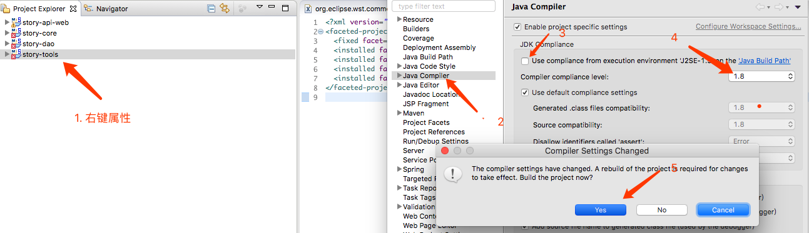

# 环境 >>

| 1. 安装jdk1.8 |
| --- |
| <http://www.oracle.com/technetwork/java/javase/downloads/jdk8-downloads-2133151.html> |
|  |

| 2. 安装tomcat |
| --- |

| 3. 安装maven |  |
| --- | --- |
| title | 修改localRepository |
| path | maven/apache-maven-3.3.9/conf/setting.xml |
| 图 |  |
| title2 | 指定maven给eclipse |
| 图 |  |

     

| 步骤 >> |  |
| --- | --- |
| 1 | workspace定位到parent的父目录;  |
| 2 |  |
| 3 | 导致maven项目,选择parent; |
| 4 | 将子项目,一个一个import as Project;  |

     

# 错误 >>

| 1 | Cannot change version of project facet Dynamic web module to 3.0 |
| --- | --- |
| 1改对应版本 |  |
| 2更新 |  |

| 2 | `Description	Resource	Path	Location	Type Java compiler level does not match the version of the in` 或 `'<>' operator is not allowed for source level below 1.7` |
| --- | --- |
| 1修改java版本 |  |
| 2更新 |  |

| 3 | Java compiler level does not match the version of the installed Java project facet. |
| --- | --- |
|  |  |
