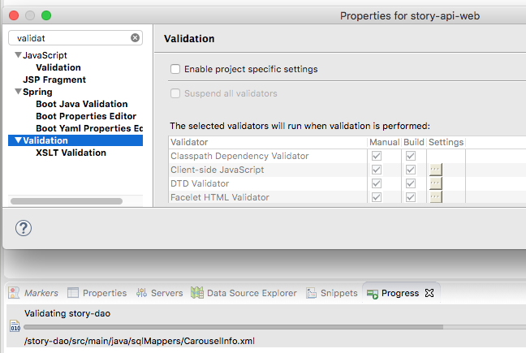

| 提示 Dynamic web 3.0错误 >> |
| --- |
| 将store-api-web改成2.5;然后自动变成了3.0;问题解决 |

***

| 校验maven依赖下载的情况 >> |
| --- |
| 项目右键runAs,maven install;成功则ok |

***

| eclipse指定tomcat >> |
| --- |
| 在Preferences-Server-Runtime Environments-Add-Next-选择JRE-完成 |

***

| kafka报错 >> |
| --- |
| hosts文件修改`参考privateNODE` |

***

| 运行超时 >> |
| --- |
| Servers-Tomcat8.5将Timeouts改成大些 |

***

| 发现Validation xxx.xml很慢 >> |
| --- |
|  |
| 注: 把build下面的对勾去掉;(但如果全去掉,好像又不再及时build;所以自行掂量) |
