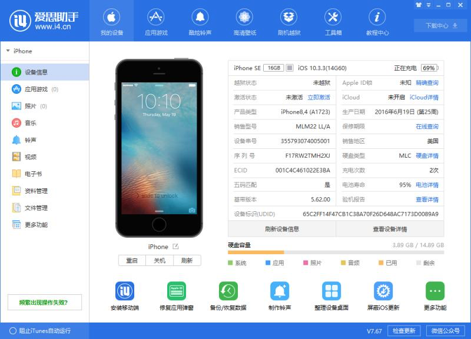
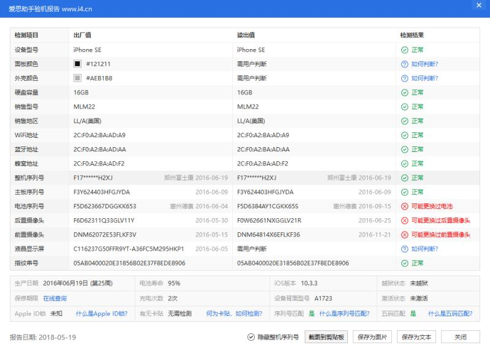

| 操作 >> |  |  |
| --- | --- | --- |
| 1 | 查看 | `*#5005*7672#` |
| 2 | 设置 | `*5005*7672*短信中心号码#` |
| 3 | 删除 | `##5005*7672#` |

| 联通短信中心号码 >> |  |  |
| --- | --- | --- |
| 1 | 北京 | +8613010112500或008613010112500 |
| 2 | 山西 | +8613010701500或008613010701500  |

| 示图 >> |
| --- |
|  |
|  |


```
ActivationState                                   Unactivated
BasebandRegionSKU                                 00000000000000000000000000000000000000000000000000000000000000000000000000000000000000000000000000000000000000000000000000000000
BasebandStatus                                    BBNotReady
BasebandVersion                                   
BluetoothAddress                                  2c:f0:a2:ba:ad:aa
BoardId                                           2
BrickState                                        true
BuildVersion                                      14G60
CPUArchitecture                                   arm64
ChipID                                            32771
DeviceClass                                       iPhone
DeviceColor                                       #121211
DeviceName                                        iPhone
DieID                                             7965163150042042
EthernetAddress                                   2c:f0:a2:ba:ad:f2
FirmwareVersion                                   iBoot-3406.60.10
HardwareModel                                     N69AP
HardwarePlatform                                  s8003
HasSiDP                                           true
HostAttached                                      true
MLBSerialNumber                                   F3Y624403HFGJYDA
MobileSubscriberCountryCode                       
MobileSubscriberNetworkCode                       
ModelNumber                                       MLM22
PartitionType                                     GUID_partition_scheme
PasswordProtected                                 false
ProductName                                       iPhone OS
ProductType                                       iPhone8,4
ProductVersion                                    10.3.3
ProductionSOC                                     true
ProtocolVersion                                   2
RegionInfo                                        LL/A
SBLockdownEverRegisteredKey                       false
SIMStatu
```


# 淘宝购入卡贴解决：


1. 装好卡贴和手机卡，按一下iPhone的“Home”键。点击“紧急呼叫”，出现“拨号盘”后，输入指令 *5005*7672*00# 拨号
2. 出来一级菜单点【TMSI自动解锁】
3. 出来二级菜单点选 us sprint
4. 点接受， 然后关机，开机。
5. 连接WIFI激活，打开数据漫游，等信号来，信号一直没出现请联系客服调试。
6. 此时激活可成功，但有时显示不出中国联通，那么见如下步骤。

***

1. 在windows下安装itunes（默认目录）
2. itunes右键属性目标改成"C:\Program Files\iTunes\iTunes.exe" -setPrefInt carrier-testing 1
3. win+R输入"%ProgramFiles%\iTunes\iTunes.exe" tPrefInt carrier-testing 1
4. 马上打开itunes并按shift加更新。选择*.ipcc 注：文件见百度云盘。work/爸爸的iphonese。

```java
//微信：rc13735344028
//淘宝：源旺数码专营店
//微博：98k卡贴
//微博视频：http://t.cn/R1cEvym?m=4244758962249819&u=3198626132
//视频文件：见百度云 work/爸爸的iphonese
```


<br><br><br><br><br>


# 淘宝入手卡贴,在换另一张北京联通卡后,出现有信号,无信号,无服务循环;

| 卖家解答 >> |
| --- |
| 1.把手机放信号较好的地方，打开4G(或LTE)和数据漫游。 |
| 2.设置，电话，SIM卡应用程序 ，点一下【重新获取信号】，如果弹出激活，点关闭，然后什么都不动，等几分钟让卡贴自动调试信号，调试完成会自动返回桌面。 |


| 实际解决 >> |
| --- |
| 1. 把手机卡放入手机,点击设置-电话;(不作任何操作) |
| 2. 此时,跳到需要激活,点关闭,然后不动,等待半分钟,好了; |


# 新封锁被破解后，手机能打不能接，解决步骤如下:

'''
呼叫 *5005*7672*88#  输入89014104278656980481 发送后重启手机。然后激活即可。
'''
